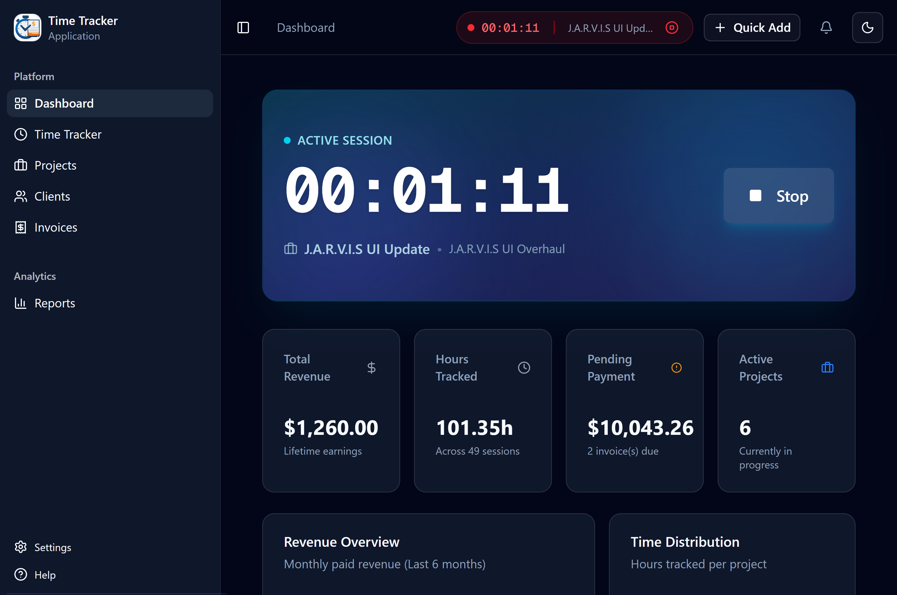
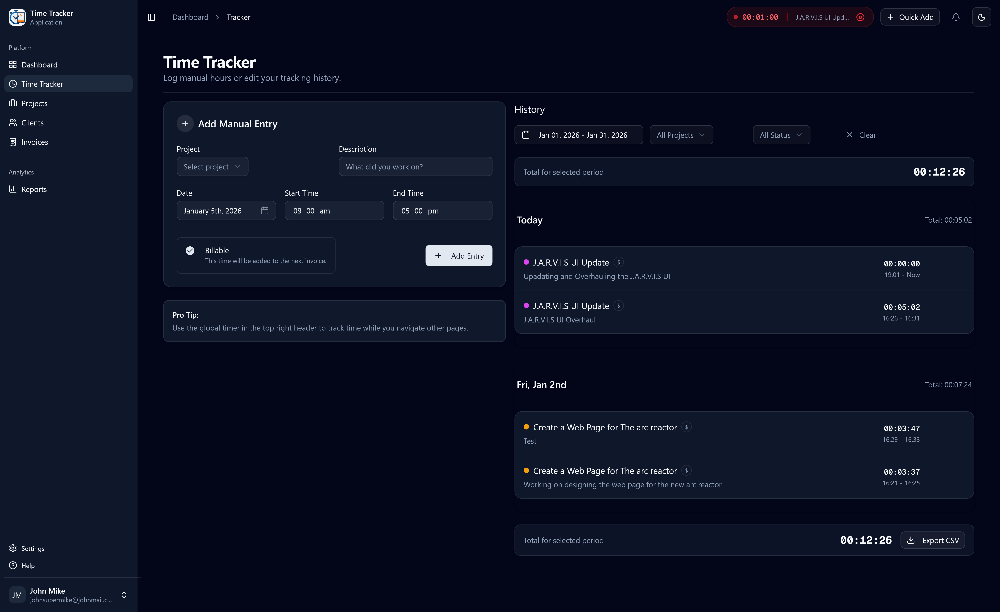
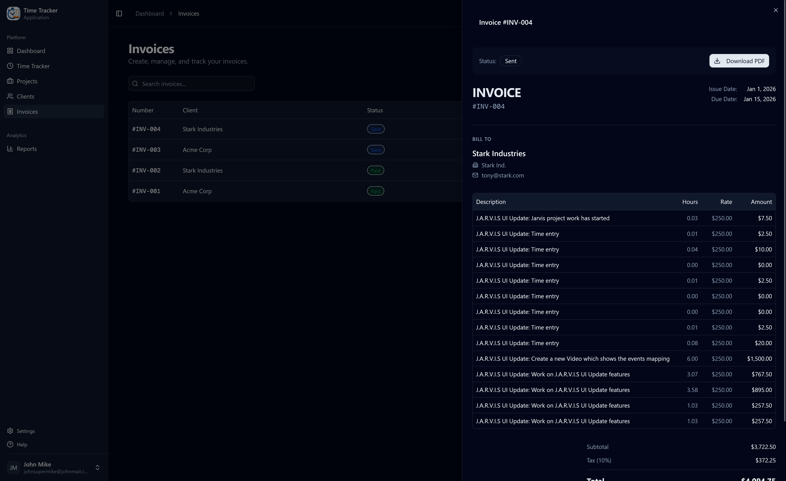

# ⏱️ Time Tracker

> Professional time tracking and invoicing platform for freelancers and agencies

[](https://your-app.vercel.app)
[](https://your-railway-app.railway.app/docs)
[](LICENSE)



## 🎯 Features

- ⏱️ **Real-time Timer** - Start/stop timer with live tracking
- 📊 **Project Management** - Organize work by projects and clients
- 👥 **Client Management** - Track clients and their projects
- 💰 **Automated Invoicing** - Generate professional invoices from tracked time
- 📄 **PDF Export** - Download invoices as PDF
- 🔐 **OAuth Authentication** - Login with Google or GitHub
- 🌓 **Dark Mode** - Full dark mode support
- 📱 **Responsive Design** - Works perfectly on mobile, tablet, and desktop
- 📈 **Analytics Dashboard** - Visual insights into time and revenue

## 🛠️ Tech Stack

### Backend

- **FastAPI** - Modern Python web framework
- **SQLModel** - SQL database ORM with Pydantic validation
- **PostgreSQL** - Relational database (hosted on Neon)
- **JWT** - Secure authentication
- **OAuth 2.0** - Google & GitHub integration
- **ReportLab** - PDF generation

### Frontend

- **Next.js 16** - React framework with App Router
- **TypeScript** - Type-safe development
- **Tailwind CSS** - Utility-first styling
- **shadcn/ui** - Beautiful component library
- **Zustand** - Global state management
- **TanStack Query** - Server state & caching
- **Axios** - HTTP client

## 🚀 Live Demo

**Try it now:** [https://your-app.vercel.app](https://time-tracker-five-lilac.vercel.app/)

**Test Credentials:**

```
Email: janedoe@example.com
Password: janedoe123
```

**API Documentation:** [https://time-tracker-wm1y.onrender.com/docs](https://time-tracker-wm1y.onrender.com/docs)

## 📸 Screenshots

### Dashboard


### Time Tracker



### Invoice Generation



## 🏗️ Architecture

```
┌─────────────────┐
│   Frontend      │
│   (Vercel)      │
│   Next.js 16    │
└────────┬────────┘
         │ HTTPS
         ↓
┌─────────────────┐
│   Backend API   │
│   (Railway)     │
│   FastAPI       │
└────────┬────────┘
         │
         ↓
┌─────────────────┐
│   Database      │
│   (Neon)        │
│   PostgreSQL    │
└─────────────────┘
```

## 💡 Key Features I Built

### 1. Real-Time Timer

- Persistent state across page refreshes
- Live elapsed time display
- Pause/resume functionality
- Auto-save to database

### 2. Automated Invoice Generation

- Select unbilled time entries
- Automatic calculation of hours and amounts
- Tax calculation support
- Professional PDF export

### 3. OAuth Integration

- Google & GitHub login
- Account linking (OAuth + email)
- Secure token management
- Callback handling

### 4. Responsive UI

- Mobile-first design
- Collapsible sidebar
- Touch-optimized interactions
- Dark mode support

## 📦 Project Structure

```
time-tracker/
├── backend/              # FastAPI backend
│   ├── main.py          # Application entry point
│   ├── models.py        # Database models
│   ├── schemas.py       # Pydantic schemas
│   ├── database.py      # Database connection
│   ├── auth.py          # Authentication utilities
│   ├── config.py        # Configuration
│   └── routers/         # API routes
│       ├── auth_routes.py
│       ├── oauth.py
│       ├── clients.py
│       ├── projects.py
│       ├── time_entries.py
│       └── invoices.py
│
└── frontend/            # Next.js frontend
    ├── app/             # App router pages
    ├── components/      # React components
    ├── lib/            # Utilities & hooks
    │   ├── api/        # API clients
    │   ├── hooks/      # Custom hooks
    │   ├── stores/     # Zustand stores
    │   ├── types/      # TypeScript types
    │   └── utils/      # Helper functions
    └── public/         # Static assets
```

## 🚀 Local Development

See individual README files:

- [Backend Setup](./backend/README.md)
- [Frontend Setup](./frontend/README.md)

## 🤝 Contributing

This is a portfolio project, but feel free to fork and build upon it!

## 📄 License

MIT License - feel free to use this project for learning or your own purposes.

## 👨‍💻 Author

**Mohammed Jameel Shahid**

- LinkedIn: [linkedin.com/in/mohammed-shahid1](https://www.linkedin.com/in/mohammed-shahid1/)
- GitHub: [@Shahid0324-GIT](https://github.com/Shahid0324-GIT)

## 🙏 Acknowledgments

- Built as a portfolio project to demonstrate full-stack development skills
- Inspired by modern time tracking tools like Toggl and Harvest
- UI components from [shadcn/ui](https://ui.shadcn.com/)

---

⭐ If you found this project helpful, please give it a star!
